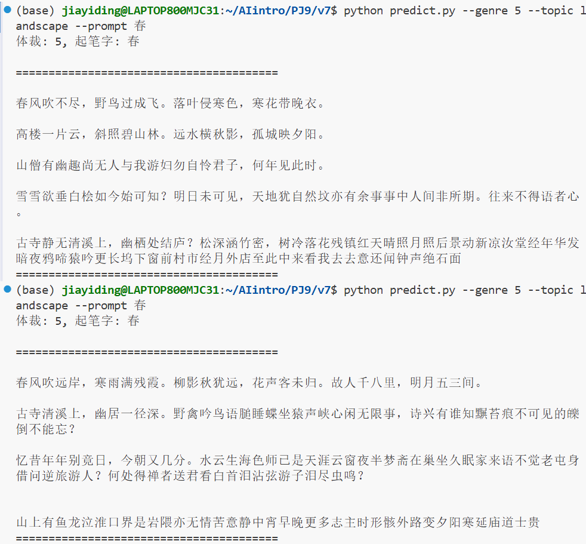

## v9改进目标：
1. 实现重复惩罚
2. 添加词牌名
3. 在五言七言词牌名对应结构的基础上实现平仄

## 改进详解
### 重复惩罚
1. 次数递增惩罚
对每个 token 的惩罚强度随其出现次数线性增加：
惩罚因子 = 1 + (rep_penalty - 1) × 出现次数
出现越频繁的词，被惩罚越严重。

2. 特殊 token 赦免
换行符 \n 不参与惩罚（避免生成无法结束）  
标点符号（中英文标点如“，。！？”等）不参与惩罚（保证诗句结构完整，防止生成后期句子结构被破坏  
错误示例：  

3. 性能优化
使用 Counter 字典维护 token 出现次数，替代每次采样时遍历列表或构造集合，将时间复杂度从 O(N²) 降至 O(unique_tokens)。

### 词牌名
### 平仄

