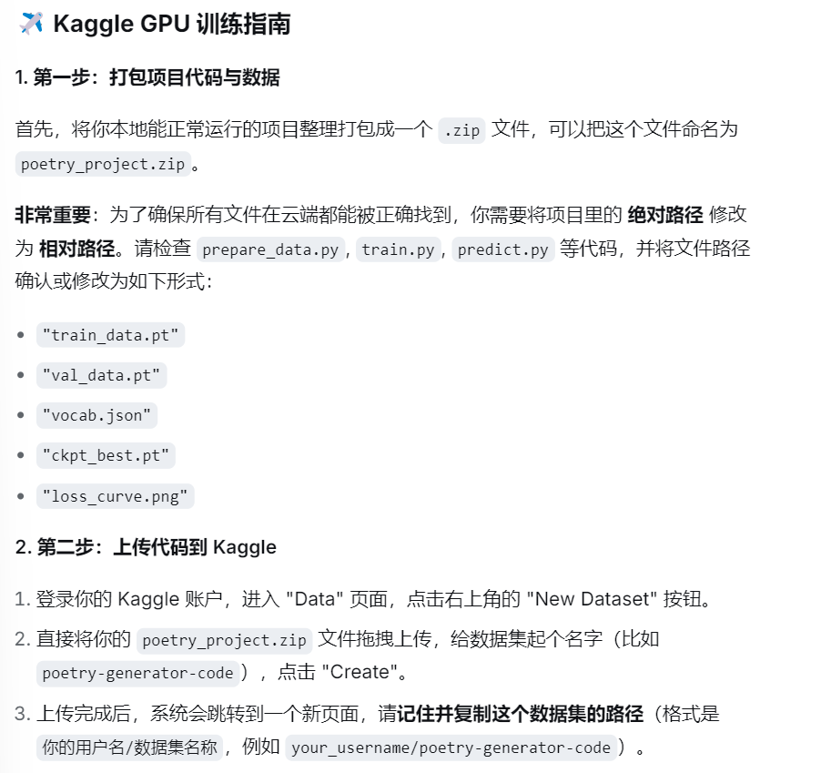
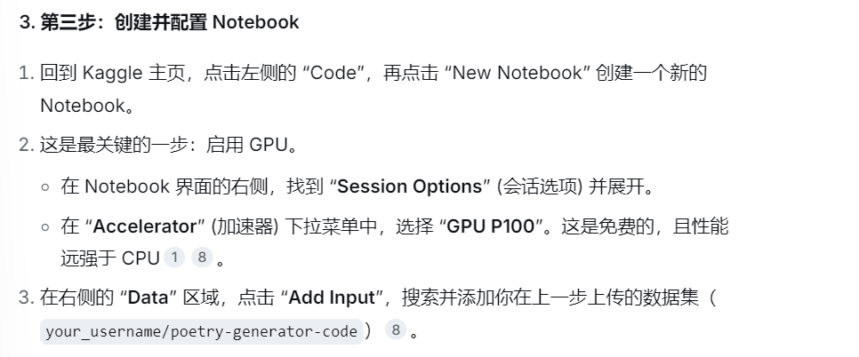
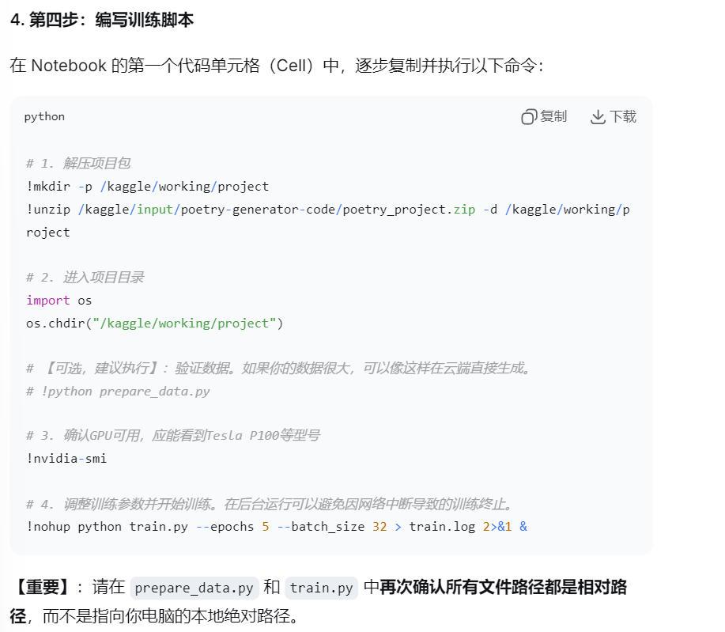
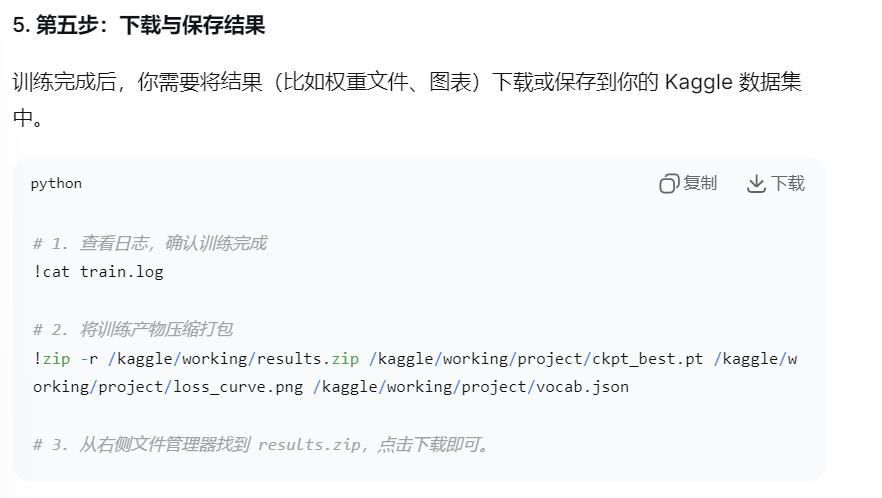
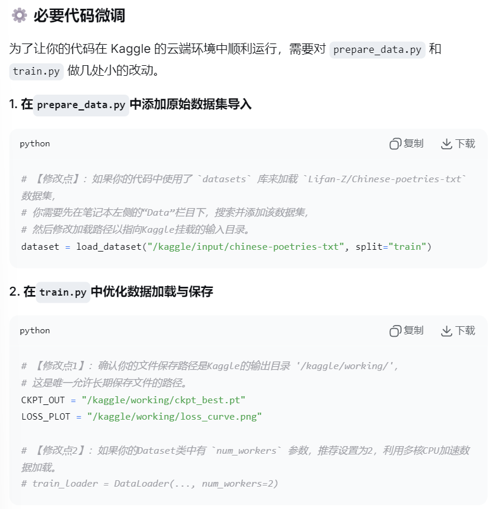
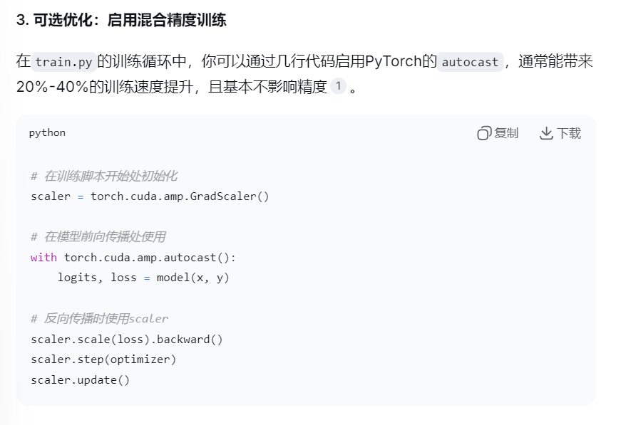
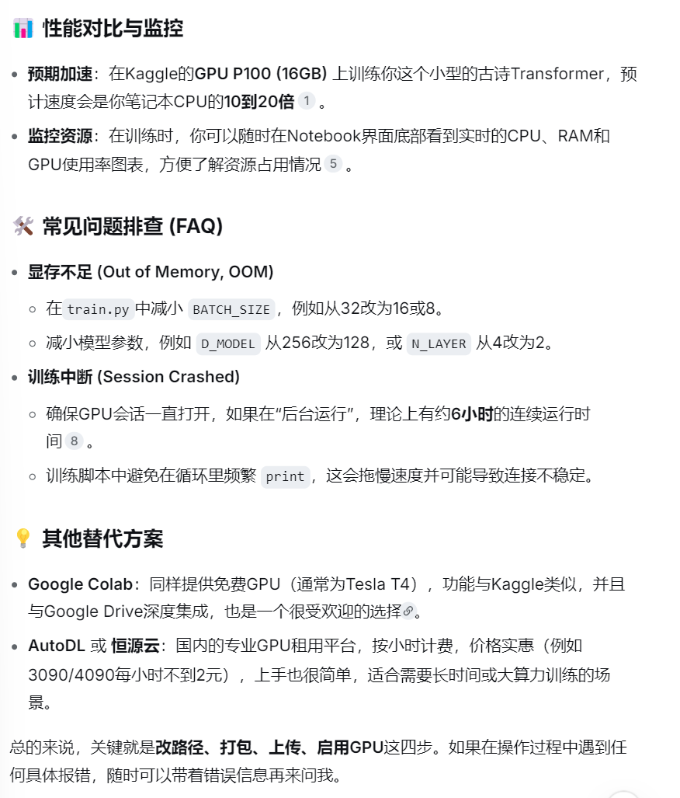

```
# 1. 解压项目包
!mkdir -p /kaggle/working/project
!unzip /kaggle/input/poetry-generator-code/poetry_project.zip -d /kaggle/working/project

# 2. 进入项目目录
import os
os.chdir("/kaggle/working/project")

# 【可选，建议执行】：验证数据。如果你的数据很大，可以像这样在云端直接生成。
# !python prepare_data.py

# 3. 确认GPU可用，应能看到Tesla P100等型号
!nvidia-smi

# 4. 调整训练参数并开始训练。在后台运行可以避免因网络中断导致的训练终止。
!nohup python train.py --epochs 5 --batch_size 32 > train.log 2>&1 &
```
 
```
# 1. 查看日志，确认训练完成
!cat train.log

# 2. 将训练产物压缩打包
!zip -r /kaggle/working/results.zip /kaggle/working/project/ckpt_best.pt /kaggle/working/project/loss_curve.png /kaggle/working/project/vocab.json

# 3. 从右侧文件管理器找到 results.zip，点击下载即可。
```





