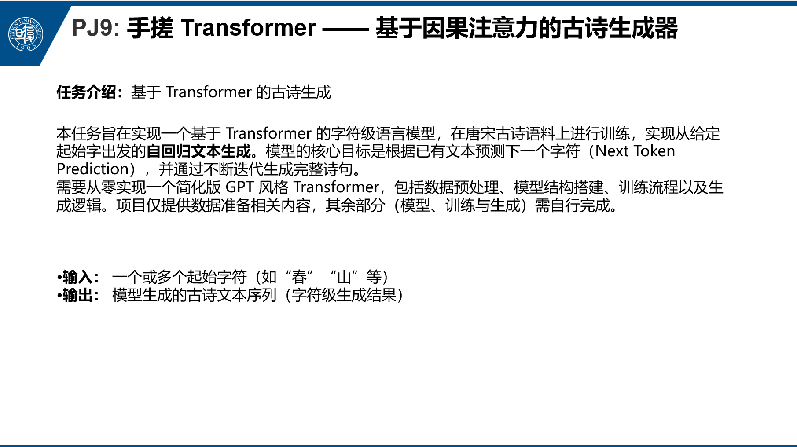
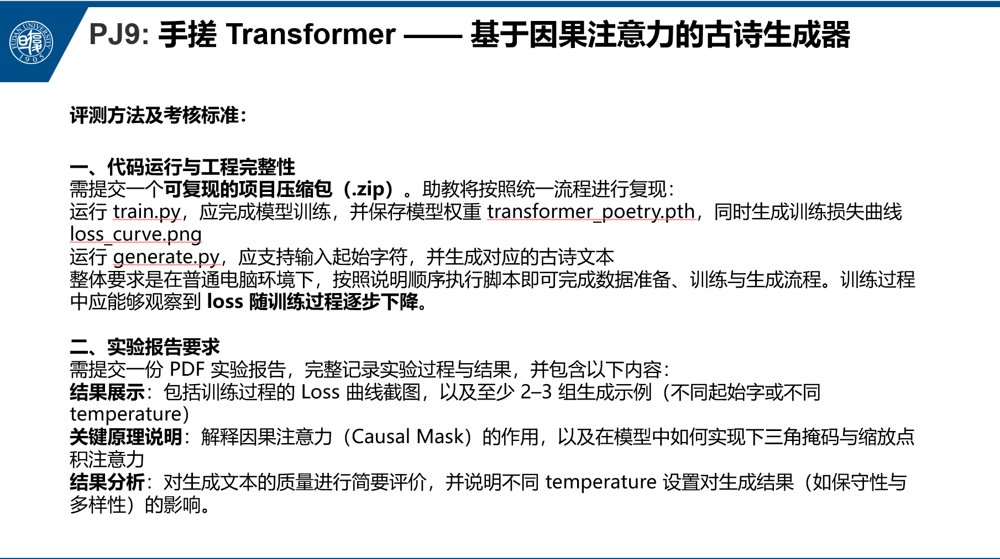
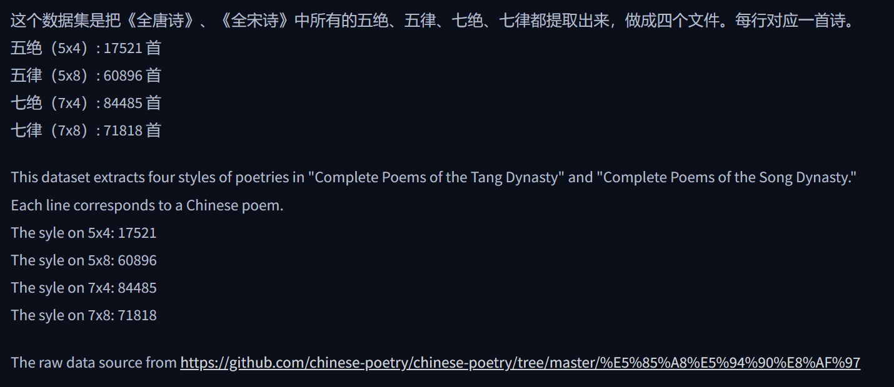
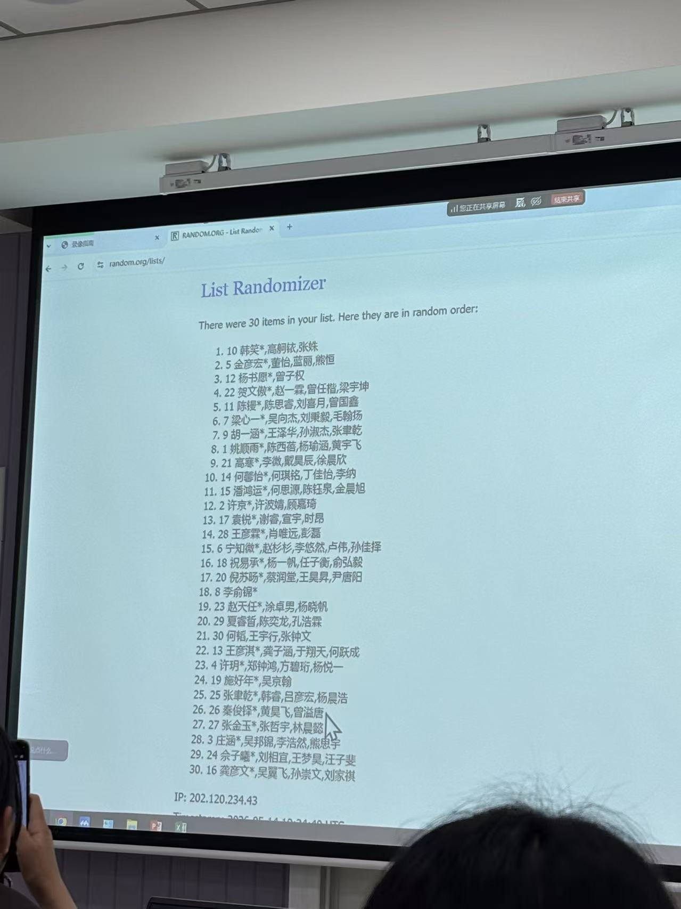
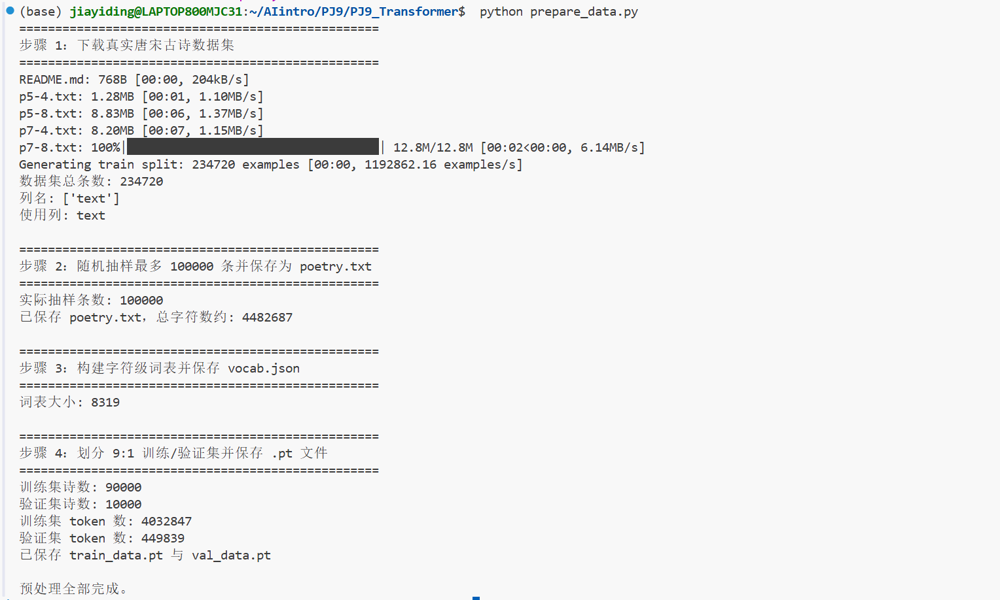
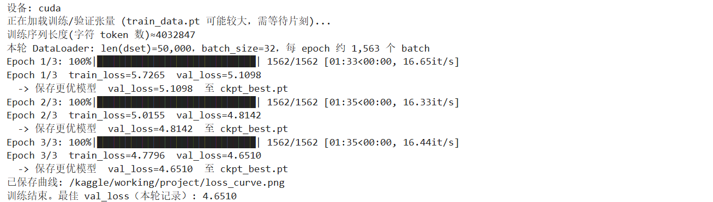

“目前我们定的是基础功能实现+报告没什么问题的话会给75-80分左右，剩下的会根据创新点和报告质量酌情给”

数据预处理完成：

第一次训练：

换成kaggle:

# PJ9: 手搓 Transformer —— 基于因果注意力的古诗生成器
算力：模型数据量不大，暂时不用担心

开放性：跑出结果就好。自己可以做很多开放性探索，放在实验报告里

训练数据：一口气全给？

“注意力”：不能把未来信息纳入到当前训练中

手搓 Transformer 

**Attention is all you need**

## 项目简介
当今大语言模型（如 GPT 系列）的核心能力，本质上可以归结为一句话：根据已有文本预测下一个词（Next Token Prediction）。通过不断地“预测下一个字 → 拼接 → 再预测”，模型便可以完成续写、对话甚至创作诗歌。  
本项目将带你从零实现一个小型 GPT 风格 Transformer，在真实唐宋古诗（故事数据格式非常**）（基础要求：生成的看起来像诗就可以了）（手动实现注意力计算过程（掩码）语料上进行字符级建模，并完成自回归生成。数据来源于 Hugging Face 数据集 Lifan-Z/Chinese-poetries-txt，我们抽样 1 万首古诗，在 8G 显存或普通 CPU 环境下即可训练。  
数据方面基本就是开源数据集  

【可以有什么高级思考🤔呢brainstorming...  
前端 is must ;  
多风格学习？有没有可能，做出来变成了只是量*n，实际内核没什么变化唉  
】

### 你将完整经历：
- 数据下载与预处理（字符级词表构建）
- 因果注意力（Causal Mask）实现
- Transformer Block 搭建
- 自回归生成逻辑实现
- 温度采样控制生成风格  
项目目标不是“调模型参数”，而是让你真正理解：模型如何在看不到未来的前提下，一个字一个字写出古诗。
### 主要知识点
- Transformer 结构与多头自注意力机制
- 缩放点积注意力（Scaled Dot-Product Attention）
- 自回归生成与温度采样（Temperature Sampling）
- 训练过程与 Loss 曲线分析
难度评级：★★★★☆  
### 硬件和平台需求
硬件：普通笔记本即可（推荐 8G 显存或等效内存）  
平台：Python 3.8+，PyTorch，numpy，matplotlib，tqdm，datasets，huggingface_hub  
负责人：郑伊柯（ykzheng25@m.fudan.edu.cn）  

### 参考资料
《人工智能导论》2026-春：第四章《机器学习（一）》  
Attention Is All You Need（Transformer 原论文）  
https://arxiv.org/abs/1706.03762 

### 提交需求：
1. 你需要提交一个可复现的 .zip 项目包，解压后能够在本地完整完成数据准备、模型训练与古诗生成流程。代码中必须包含 prepare_data.py、model.py、train.py、generate.py 等核心文件，保持目录结构清晰，确保在不修改训练脚本的情况下可直接运行。运行 prepare_data.py 后应生成 poetry.txt、vocab.json、train_data.pt、val_data.pt；运行 train.py 后应保存模型权重 transformer_poetry.pth 并生成 loss_curve.png；运行 generate.py 后能够根据给定起始字生成古诗文本。
2. 报告部分需提交 PDF，内容至少包括：因果注意力（Causal Mask）的实现原理说明，以及你在 CausalSelfAttention 中如何实现下三角掩码与缩放点积计算；训练过程的 Loss 曲线截图与简要分析；至少 2–3 组生成结果（不同起始字或不同 temperature），并简要评价生成质量与变化趋势。若你完成温度调节实验，请说明不同 temperature 对诗歌“保守性”与“创造性”的影响。
3. 最终将代码与 PDF 报告打包为一个 .zip 文件，按课程要求提交至指定平台或发送至助教邮箱（以课程通知为准）。
