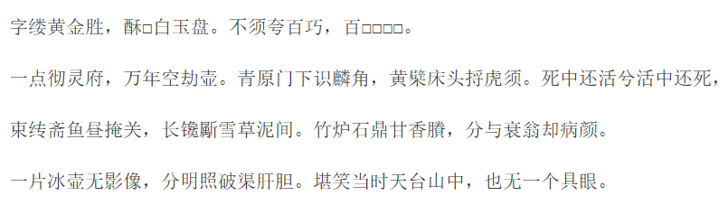
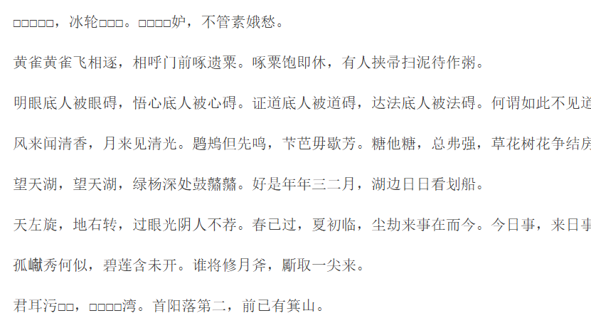

# 目前协作已完成改进：
- v2 5/7/ci分类、繁体字转换为简体字
- v4 待办：词牌名
- v5 风格分类

# ding's计划
- 处理一下数据（拒绝读取存在乱码的数据）；
- 训练提速(通过优化代码，在不影响训练效果的前提下，减低训练时间优化训练效果)
- 处理平仄

关于temperature的建议：可以直接搞平仄？temperature是不是有点绕弯子了？

一些图片留存：
初次训练耗时久

v1效果：

读取到了一些奇怪的东西：

